<!-- ═════════════════════════════ HERO ═════════════════════════════ -->

 

 

<!-- ═════════════════════════════ ABOUT ═════════════════════════════ -->

### Hi, I'm Alpha 👋

I'm a **full-stack software engineer** who designs, builds and ships production systems **end to end**: the Django API and database, the React web app, the React Native mobile app, and the ESP32 sensor out in the field.

🏢 &nbsp;**Founder & lead engineer** at [**Dubzig Investments**](https://dubzig.co.zw) 
🧠 &nbsp;**Researching** LLMs for Shona language & heritage, and AI-assisted learning 
🌍 &nbsp;**Building for Africa:** offline-first, low bandwidth, EcoCash / OneMoney 
⚡ &nbsp;**30+ projects** across EdTech, AgriTech, FinTech, IoT & culture 
🤝 &nbsp;**Open to** remote roles, contracts & startup partnerships

 

 

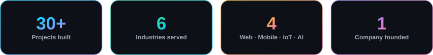

 

<!-- ═════════════════════════════ STACK ═════════════════════════════ -->

<table>
<tr>
<td align="center" width="50%"><b>Languages</b>  </td>
<td align="center" width="50%"><b>Backend</b>  </td>
</tr>
<tr>
<td align="center"><b>Frontend & Mobile</b>  </td>
<td align="center"><b>AI / ML</b>  &nbsp;</td>
</tr>
<tr>
<td align="center"><b>Data</b>  </td>
<td align="center"><b>IoT, DevOps & Tools</b>  </td>
</tr>
</table>

 

<!-- ═════════════════════════════ WORK ═════════════════════════════ -->


<a href="https://github.com/AlphaZigy/ubuntuintelligence"></a>
<a href="https://github.com/AlphaZigy/SRLMS"></a>


<a href="https://github.com/AlphaZigy/AgriDoctor"></a>
<a href="https://github.com/AlphaZigy/SolCure"></a>



<a href="https://github.com/AlphaZigy/aogzim.org.zw"></a>
<a href="https://github.com/AlphaZigy/aog-hymns"></a>
<a href="https://eventive.co.zw"></a>

<b>&nbsp;🌐 More client websites & platforms</b>

 

| Project | What it is |
|---|---|
| **DubZig** | Company site and client portal · Django 6 + React |
| **DagMedia** | News publishing platform with Google One-Tap sign-in |
| **City of Harare Stand Application** | Stand application & allocation workflow · *academic prototype* |
| **Miss People's Choice 2026** | Pageant voting platform · TanStack Start + Supabase |
| **Karoi Agricultural Show** | Launch site built around photography · React 19 + Motion |
| **Seed Store** | Storefront for the K2 and Agriseeds seed brands · Cloudflare |
| **SLZ** | Prerendered static marketing site |
| **[Tengai](https://github.com/AlphaZigy/Tengai)** | Conversational AI chatbot for ordering food |
| **[Shipping Management System](https://github.com/AlphaZigy/Shipping-Management-System)** | Logistics platform · Django REST + React |

🔒 Many of these are client or commercial products in private repositories. I'm happy to walk through the architecture and code on request.

 

<!-- ═════════════════════════════ PRINCIPLES ═════════════════════════════ -->

**📡 Offline-first when the network can't be trusted.** 
Sales, stock and hymnals keep working without a signal.

**🧠 AI that stays grounded.** 
Retrieval, approved answers, and verification before anything reaches a user.

**🚀 Deployments that fit the client's hosting.** 
Pinned dependencies, pure-Python wheels, Passenger on cPanel when that's what the client has.

**📘 Honest documentation.** 
Architecture notes, API references and status reports that separate what's verified from what's only written.

 

 

<!-- ═════════════════════════════ ANALYTICS ═════════════════════════════ -->

<picture>
  <source media="(prefers-color-scheme: dark)" srcset="https://raw.githubusercontent.com/AlphaZigy/AlphaZigy/output/snake-dark.svg" />
  <source media="(prefers-color-scheme: light)" srcset="https://raw.githubusercontent.com/AlphaZigy/AlphaZigy/output/snake-light.svg" />
  
</picture>

 

<!-- ═════════════════════════════ CONNECT ═════════════════════════════ -->

  

<b>💼 Freelance & contracts &nbsp;·&nbsp; 🌍 Remote roles &nbsp;·&nbsp; 🚀 Startup partnerships &nbsp;·&nbsp; 🎓 Mentorship</b>

 

  

<i>“Shaping a greener and smarter future, one solution at a time.”</i>

